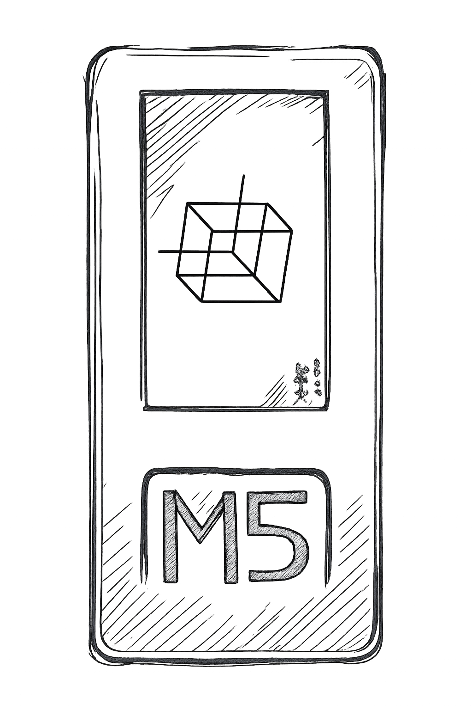

# Part 1: Setting up M5Stick C Plus

The M5Stick C Plus is a compact ESP32-based IoT device with a built-in screen, battery and WiFi. It's cheap (~£30), easy to program and perfect for prototyping Physical AI systems. The device can do far more (sensors, motion, networking), but we're keeping it basic to focus on the Physical AI concept itself. 



## What You'll Need

- M5Stick C Plus or ESP32 alternative
- USB-C cable (data cable, not power-only)
- Arduino IDE 2.x
- Mac/PC with Arduino IDE
- M5StickC drivers (CP210x for Mac)
- M5StickC library

## Step 1: Install Arduino IDE

Download from [arduino.cc](https://www.arduino.cc/en/software)

## Step 2: Add M5Stack Board Support

1. Open Arduino IDE
2. Go to **File → Preferences**
3. Add to "Additional Board Manager URLs":
   ```
   https://m5stack.oss-cn-shenzhen.aliyuncs.com/resource/arduino/package_m5stack_index.json
   ```
4. Go to **Tools → Board → Boards Manager**
5. Search "M5Stack" and install

## Step 3: Install M5StickCPlus Library

1. Go to **Sketch → Include Library → Manage Libraries**
2. Search "M5StickCPlus"
3. Install the library

## Step 4: Basic Blue Screen Test

Create new sketch and paste:

```cpp
#include <M5StickCPlus.h>

void setup() {
  M5.begin();
  M5.Lcd.setRotation(3);
  M5.Lcd.fillScreen(TFT_BLUE);
}

void loop() {
  M5.update();
}
```

## Step 5: Upload to M5Stick

1. Connect M5Stick via USB-C
2. Select **Tools → Board → M5Stick-C-Plus**
3. Select **Tools → Port** (usually `/dev/cu.usbserial-*` on Mac)
4. Click **Upload** button

Our M5Stick screen should turn blue!

## Lessons Learned

- Dusting off my old Mac mini and expecting it to run was ambitious
- Not all USB to USB-C cables are created equal. I quickly found out that every USB to USB-C cable in the building was for power only. A data cable is needed. Nothing a visit to Amazon didn't fix.
- **Arduino debugging basics**: Set Serial Monitor baud rate to 115200 (Tools → Serial Monitor). Use `Serial.println()` for debug output.
- **M5Stick connection issues**: If upload fails, try different USB ports, restart Arduino IDE, or press the reset button on M5Stick during upload.

## Next Steps

[Part 2: Why MQTT for IoT Communication →](02-mqtt-setup.html)
